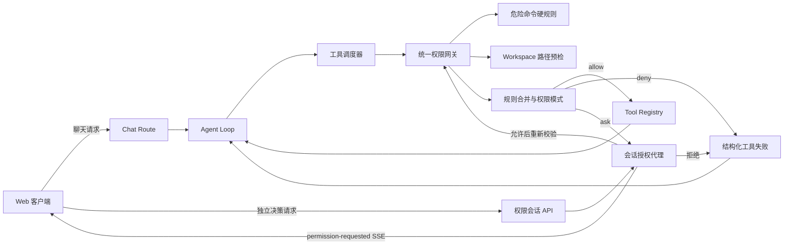

# 五层权限系统 Plan

状态：已批准
依据：已批准的 `spec.md`

## 架构概览

本轮在现有 `ToolRegistry → ModeToolPolicy → tool-scheduler → AgentLoop → Web SSE` 链路中加入统一的权限网关。权限领域规则保持为不依赖 React、Next.js 和具体工具实现的 TypeScript 模块；工具适配层只声明“本工具用哪个命令或路径作为权限目标”，不自行判断允许、询问或拒绝。

权限网关按以下顺序处理每个已完成 JSON 与 Schema 校验的调用：

1. 现有 Plan/Do 工具范围先拒绝当前模式不可用的工具。
2. 预解析工具的权限目标；命令进入危险操作检测，路径通过 Workspace 规范化、真实路径和符号链接解析。
3. 合并用户级、项目级、本地级全部匹配规则，按 `deny > ask > allow` 得到显式结果；没有匹配时才应用权限模式默认值。
4. `deny` 直接生成结构化工具失败；`ask` 由会话授权代理创建等待项并暂停调度；`allow` 或有效人工授权继续执行。
5. 真正执行前重新检查取消、危险操作、路径身份和规则快照，随后才调用注册工具；工具原有沙箱、超时和错误收敛继续生效。



服务端为每个页面对话创建不可猜测的权限会话。聊天 SSE 在等待人工确认时保持打开；客户端通过独立同源 JSON 接口提交决定，服务端定位原等待项并唤醒原 Promise，使同一个 Agent Loop 从暂停点继续。无需轮询或 WebSocket，也不把 Agent 状态机移到路由或页面。

## 需求映射

| 需求 | 负责模块/交互 | 设计说明 |
| --- | --- | --- |
| F1 | 工具准备契约、统一权限网关、工具调度器 | 注册工具先被准备为不可变调用，再由网关授权；调度器只执行网关返回的可执行调用。不存在页面或单工具直接跳过网关的执行入口。 |
| F2 | 危险命令检测器、权限网关 | 使用不可从 YAML 注入或覆盖的数据规则，按受限 POSIX shell 词法扫描命令段、链式操作和可静态提取的 shell 包装；命中或高风险结构无法安全判定时在启动进程前硬拒绝。 |
| F3 | Workspace 边界、路径权限目标解析器 | 以 `realpath`、逐级文件状态和 `path.relative` 判断真实目标是否在规范根内；读取现有目标和创建目标分别处理，规则匹配使用解析后的 Workspace 相对 POSIX 路径。 |
| F4 | 命令权限目标解析器、现有命令沙箱 | 命令 `cwd` 先经 Workspace 边界解析；获准后仍由当前 Seatbelt 限制文件、网络、环境和子进程，权限模式不改变沙箱 profile。 |
| F5 | 规则解析器、目标类型元数据、Glob 匹配器 | YAML 键解析为 `工具名(模式)`；无通配符时做完整相等，有通配符时命令使用全字符串字符 Glob，路径使用分段 Glob，均有长度和复杂度上限。 |
| F6 | 权限配置仓储 | 从三个固定层级读取同一 Schema，缺失视为空配置；解析错误、未知字段、alias、重复键、未知工具或非法规则转为安全配置错误，不建立宽松规则集。 |
| F7 | 规则合并器 | 收集所有层级、所有匹配项后只按决策强度归并；层级、出现顺序、精确度不参与优先级。 |
| F8 | 权限策略评估器 | 无匹配规则时，根据 `strict/default/permissive` 与工具权限种类应用已批准矩阵；硬拒绝、Plan 限制和显式规则先于该默认值。 |
| F9 | 权限会话、权限模式控件与会话 API | 服务端会话保存当前权限模式，初始为 `default`；客户端切换经服务端校验成功后才更新 UI。正在等待的调用保留创建时决定，不被模式切换追溯批准。 |
| F10 | 授权代理、Agent 事件、SSE 合约、确认卡片 | `ask` 创建含请求 ID、安全参数摘要、风险、来源、Workspace 摘要和过期时间的等待项；调度器发出事件后等待，工具尚未进入 started 状态。 |
| F11 | 授权决策 API、会话精确授权、配置写入器 | 四种决定分别产生单次令牌、会话目标授权、本地级精确 `allow` 规则或用户拒绝。会话/永久授权只满足同一工具与规范化命令或路径的 `ask`，不覆盖 `deny`。 |
| F12 | 权限会话管理器、授权指纹 | 服务端保存原准备调用，不接受客户端回传工具参数；请求 ID、会话绑定、Workspace、调用指纹和一次性状态共同防止重复、替换、跨会话或迟到决定。 |
| F13 | AbortSignal、会话关闭 API、等待项过期清理 | 请求取消立即移除其等待项；清空、切换 Workspace/Provider 和页面关闭会关闭权限会话；等待项有独立超时，会话有空闲回收，迟到决定始终无效。 |
| F14 | 权限失败类型、Agent Loop 工具结果回传 | 危险操作、Workspace 越界、规则拒绝、用户拒绝、配置错误和无效授权使用可区分错误种类，均为 `sideEffect: none`；除取消外按现有 tool 消息协议返回模型继续迭代。 |
| F15 | 两阶段准备/执行、恢复前复检 | 权限检查不执行工具；人工允许后复检取消、目标、危险规则和最新合并规则。只有复检仍未命中硬拒绝或 `deny` 时才发出 tool-started 并开始工具超时计时。 |
| F16 | 本地权限配置写入器 | 永久授权只写 Workspace 本地级文件；在服务端进行符号链接与边界检查、内容重读、身份冲突检查、临时文件同步和原子替换，失败不产生授权令牌。 |
| F17 | Web reducer、确认卡片与安全展示器 | UI 以服务端事件为事实来源展示等待、提交中、允许、拒绝、取消和过期；参数由服务端按工具生成有界脱敏摘要，React 仅作为文本渲染。 |

## 核心类型与接口

以下签名固定模块边界，不代表最终实现细节。

```ts
export type PermissionMode = "strict" | "default" | "permissive";
export type PermissionDecision = "allow" | "ask" | "deny";
export type PermissionToolKind = "read" | "write" | "command";
export type PermissionRuleLayer = "user" | "project" | "local";

export type PermissionSubject =
  | {
      readonly kind: "path";
      readonly toolName: string;
      readonly toolKind: "read" | "write";
      readonly requestedPath: string;
      readonly canonicalRelativePath: string;
    }
  | {
      readonly kind: "command";
      readonly toolName: string;
      readonly toolKind: "command";
      readonly command: string;
      readonly canonicalCwd: string;
    };

export type PermissionRule = {
  readonly source: PermissionRuleLayer;
  readonly toolName: string;
  readonly targetKind: PermissionSubject["kind"];
  readonly pattern: string;
  readonly matchKind: "exact" | "glob";
  readonly decision: PermissionDecision;
};

export type PermissionEvaluation =
  | { readonly kind: "allow"; readonly reason: PermissionReason }
  | { readonly kind: "ask"; readonly reason: PermissionReason }
  | {
      readonly kind: "deny";
      readonly reason: PermissionReason;
      readonly errorKind:
        | "dangerous-operation"
        | "workspace-boundary"
        | "permission-denied"
        | "permission-config";
    };
```

`PermissionReason` 保存可公开的来源类别、命中的决策集合和风险等级，不保存配置绝对路径、用户主目录或敏感原文。规则匹配器返回全部匹配项，评估器负责归并；二者分开，便于独立验证优先级。

```ts
export type ToolPreparationResult =
  | { readonly kind: "ready"; readonly call: PreparedToolCall }
  | { readonly kind: "failure"; readonly result: ToolExecutionResult };

export interface PreparedToolCall {
  readonly name: ToolName;
  readonly mutability: ToolMutability;
  readonly permissionTarget: ToolPermissionTarget;
  execute(context: ToolExecutionContext): Promise<ToolExecutionResult>;
}

export interface PermissionGateway {
  authorize(
    call: PreparedToolCall,
    context: PermissionExecutionContext,
  ): Promise<PermissionAuthorization>;
  revalidate(
    authorization: PermissionAuthorization,
    context: PermissionExecutionContext,
  ): Promise<PermissionRevalidation>;
}
```

工具 Schema 只解析一次。`PreparedToolCall` 在注册中心内部闭包持有已验证输入，外部不能替换参数；其 `permissionTarget` 来自工具定义上的声明式目标元数据。各工具只声明路径字段、路径用途或命令字段，不包含规则合并、模式判断和等待逻辑。缺少权限目标元数据的工具不能注册，从类型和启动检查上保持默认拒绝。

```ts
export type PermissionPrompt = {
  readonly requestId: string;
  readonly toolCallId: string;
  readonly toolName: string;
  readonly workspace: { readonly id: string; readonly name: string };
  readonly summary: JsonObject;
  readonly risk: { readonly level: "low" | "medium" | "high"; readonly message: string };
  readonly source: "rules" | "mode";
  readonly persistentLayer: "local";
  readonly expiresAt: string;
};

export type PermissionUserDecision =
  | "allow-once"
  | "allow-session"
  | "allow-permanent"
  | "deny";

export interface PermissionApprovalBroker {
  request(
    input: ApprovalRequestInput,
    signal: AbortSignal,
  ): Promise<ApprovalHandle>;
  resolve(
    sessionId: string,
    requestId: string,
    decision: PermissionUserDecision,
  ): Promise<ApprovalResolveResult>;
  closeSession(sessionId: string): void;
}
```

一次授权的指纹覆盖完整已验证参数；会话与永久规则的精确键只覆盖规则语义允许表达的部分，即“工具名 + 规范化命令或规范化路径”。因此同一路径的不同写入内容可复用会话授权，而本次授权不能被替换为不同内容。

Agent 事件新增两个判别分支：

```ts
type PermissionAgentEvent =
  | {
      readonly type: "permission-requested";
      readonly iteration: number;
      readonly sequence: number;
      readonly request: PermissionPrompt;
    }
  | {
      readonly type: "permission-resolved";
      readonly iteration: number;
      readonly sequence: number;
      readonly requestId: string;
      readonly outcome:
        | "allowed-once"
        | "allowed-session"
        | "allowed-permanent"
        | "denied"
        | "cancelled"
        | "expired";
    };
```

`permission-resolved` 只描述审批生命周期；拒绝的模型可见语义仍由随后到达的 `tool-result` 携带。取消整个请求时保持现有唯一 `stopped(cancelled)` 终止事件。

## 状态与交互

### 权限会话生命周期

1. 页面加载配置目录时，同时向服务端创建权限会话，服务端生成随机 ID，模式初始化为 `default`。
2. 每个聊天请求只携带权限会话 ID。服务端将权限会话首次绑定到当前 Workspace 与 Provider；后续请求必须保持一致。
3. 权限模式切换调用会话更新接口。服务端成功后客户端才更新模式；当前等待项继续使用创建时评估结果。
4. 会话授权按“Workspace + 工具名 + 规范化目标”保存于服务端内存，不进入浏览器历史或模型上下文。
5. 清空对话、切换 Workspace、切换 Provider或页面卸载时，客户端关闭旧会话并创建新会话。活动聊天先接收取消，所有等待项失效。
6. 页面卸载请求只能尽力发送，因此服务端同时以活动请求取消和空闲 TTL 清理兜底。服务重启后等待项与会话授权全部丢弃，符合已批准规格。

### 单个工具调用

1. 调度器按模型顺序解析 JSON，并请求 ToolAccess 准备调用；未知工具、Plan 禁止和无效参数沿用现有结构化失败。
2. 权限网关解析真实权限目标。路径预检不读取文件正文、不写入文件；命令检测不启动 shell。
3. 硬边界失败立即返回结果。否则策略评估器加载的规则快照产生 `allow/ask/deny`。
4. `allow` 直接进入执行复检；`deny` 生成 tool-result；`ask` 先检查是否有匹配的会话授权，没有才注册等待并发出 `permission-requested`。
5. 调度器等待授权期间不启动工具，也不消耗文件或命令执行超时。授权等待独立最多 5 分钟；过期产生无副作用权限失败并允许 Agent 继续。
6. 用户拒绝产生 `permission-resolved(denied)` 与 `user-denied` tool-result；允许产生对应 resolved 事件，然后重新解析目标、重新运行危险规则并重新加载三层规则。新出现的硬拒绝或 `deny` 优先于刚才的允许。
7. 复检成功后才发出 `tool-started`，创建原有 10 秒文件/120 秒命令 deadline 并执行工具。执行结果按现有顺序回传模型。

### 多工具调度

- 调度器保留“连续且已立即获准的只读调用分组并发，写入和命令串行”的现有规则。
- `ask` 是调度边界：同一模型响应中的待确认调用按原 sequence 逐一询问，避免同时弹出多个可互相影响的副作用授权。每项仍有独立请求 ID，前一项决定不会批准后一项。
- 询问前已经完成的工具结果保留；取消后未开始的调用保持 skipped/cancelled，已发生副作用继续由现有 sideEffect 聚合准确报告。
- 过期和拒绝只完成当前工具项，Agent Loop 收齐整批有序结果后继续下一次模型迭代。

### Web 人在回路

- 原聊天 SSE 新增 `permission-requested` 和 `permission-resolved`，保持单流、单 Agent Loop。
- 决策接口只接收枚举决定，不接收工具名、参数、Workspace 或保存路径；服务端完全使用等待项中保存的数据。
- UI 在对应工具卡中展示服务端摘要和四个按钮，提交后进入“提交中”，以 SSE resolved/result 为最终状态，不乐观执行。
- 等待授权时仍可停止生成。清空、Workspace 或 Provider 切换作为“结束当前会话”操作可用：先中止聊天与关闭权限会话，再应用选择；Plan/Do 与权限模式控件在当前等待项解决前不追溯改变它。
- 会话决策接口使用同源 JSON、严格字段校验和不可猜测会话/请求 ID；拒绝非同源状态变更请求。OrbitCode 仍只面向本机，不把该机制描述为公网认证。

## 模块设计

### 权限领域模型

- 职责：定义权限模式、规则、目标、决策、原因、授权令牌和错误分类；实现规则解析、匹配、合并与默认模式矩阵。
- 对外契约：输入规范化 `PermissionSubject`、规则集合、模式和可选会话授权，输出判别完整的 `PermissionEvaluation`。
- 依赖：仅 TypeScript/JavaScript 标准能力及有界 Glob 抽象；不依赖 React、Next.js、文件工具或 Web 请求。
- 错误处理：非法规则在配置装载阶段形成 `permission-config`；评估器不捕获后静默忽略。

### 工具准备与权限网关

- 职责：把已验证工具输入变成不可变准备调用，提取权限目标，按硬边界、策略、人工授权、恢复复检顺序决定是否执行。
- 对外契约：Tool Registry 提供 prepare；网关返回允许执行、结构化拒绝或授权等待句柄。
- 依赖：权限领域模型、WorkspaceBoundary、危险命令检测器、配置仓储、授权端口和现有 Tool Registry。
- 错误处理：任何未知异常收敛为无泄漏的结构化权限/执行错误；未能确定权限目标时默认拒绝。

### 危险命令检测器

- 职责：在 shell 启动前进行有界词法扫描，识别破坏根目录或 Workspace 根、磁盘与设备擦写、广域权限/所有权修改、关机重启、广域进程终止、进程耗尽和禁用安全边界等固定类别；递归扫描可静态提取的 `sh -c` 等包装。
- 对外契约：返回安全、命中某一硬规则，或因高风险动态结构无法可靠分析而拒绝；只返回规则代码和安全风险说明，不返回敏感环境。
- 依赖：标准字符串处理；规则表编译在代码中，不读取 YAML。
- 错误处理：扫描深度、命令长度、嵌套和 token 数均有限制；超过分析边界时拒绝，不降级到普通 `ask`。

### Workspace 路径预检

- 职责：统一解析文件路径、查找/搜索起点和命令 cwd；输出请求路径与规范真实相对路径，供规则和批准指纹使用。
- 对外契约：扩展 WorkspaceBoundary 的解析能力，既支持现有/新建目标，也能在执行前复检身份。
- 依赖：Node.js `path` 与文件系统 promise API。
- 错误处理：使用 `path.relative` 判断包含关系；解析请求路径和最终真实路径都检查受保护文件。外部符号链接拒绝，指向 Workspace 内部的链接使用规范真实目标；写入始终操作已解析的内部目标并在提交前重检。

### 权限配置仓储

- 职责：读取三个层级、校验 YAML、生成规则来源信息、重新加载规则快照，以及原子写入本地级永久允许。
- 对外契约：`load(workspaceRoot)` 返回不可变规则集合；`addLocalAllow(...)` 返回写入后的新快照或结构化失败。
- 依赖：Node.js 文件系统、`os.homedir()`、现有 `yaml` 包、Workspace 规范根。
- 错误处理：文件缺失为空集合；其他读取/解析/Schema/边界/并发错误失败关闭。配置内容上限 256 KiB、每层最多 512 条、合并最多 1536 条。

固定位置与格式：

```text
用户级：~/.orbitcode/permissions.yaml
项目级：<workspace>/.orbitcode/permissions.yaml
本地级：<workspace>/.orbitcode/permissions.local.yaml
```

```yaml
rules:
  "run_command(git *)": allow
  "write_file(src/**)": ask
  "read_file(.env*)": deny
```

根节点只能包含 `rules`，规则值只能为三个决策。项目级适合共享规则，本地级用于当前机器的精确授权；Web 永久允许只写本地级。项目与本地权限文件加入受保护路径，文件工具和命令沙箱均不能读写，只有服务端配置仓储能访问。

### 授权代理与权限会话管理器

- 职责：创建/更新/关闭权限会话，绑定 Workspace 与 Provider，保存模式和会话授权，注册可取消等待项并一次性解析决定。
- 对外契约：进程内管理器供聊天路由和权限会话 API 共享；授权代理只暴露领域接口，不暴露内部 Map 或 Deferred。
- 依赖：Node.js crypto、计时器、AbortSignal 和可注入时钟/ID 生成器。
- 错误处理：每会话最多 1 个活动 Agent 轮次和 16 个等待历史项；授权等待 5 分钟过期，会话空闲 30 分钟回收。关闭、过期、重复和不匹配操作幂等拒绝并清理监听器。

### Agent Loop、调度器与事件

- 职责：在现有模型—工具循环中转发权限事件、等待网关、维持工具结果顺序和取消语义。
- 对外契约：ToolScheduleEvent 与 AgentEvent 增加 permission 分支；Agent Loop 不理解 YAML、按钮或文件位置。
- 依赖：权限网关接口和现有工具/Provider 抽象。
- 错误处理：工具错误集合增加 `dangerous-operation`、`workspace-boundary`、`permission-config`、`user-denied` 和 `approval-invalid`。用户拒绝、硬拒绝、已绑定等待项的授权复检失效和过期是普通工具失败；无法绑定到任何等待项的畸形/未知 API 提交仅返回 4xx 且不改变原等待项。请求取消仍是 Agent 停止。每轮继续保持唯一 stopped 事件和最大迭代限制。

### Web 合约、路由与页面

- 职责：创建/更新/关闭权限会话、提交决定、严格解析新事件、展示模式与批准卡，并在会话切换时执行取消与清理。
- 对外契约：新增权限会话 REST 合约；聊天请求增加服务端签发的权限会话 ID，不再由客户端声明权限模式。
- 依赖：Route Handler 调用服务端会话管理器和权限配置组装；组件只依赖共享 JSON 合约。
- 错误处理：API 严格限制 body、字段、ID 和枚举；页面区分提交失败与 SSE 最终状态，可重试合法决定但不重复执行。服务端错误不包含配置绝对路径或内部堆栈。

### 安全展示与系统提示

- 职责：按工具生成审批摘要与风险，不把完整写入内容、替换正文、受保护路径内容或疑似凭据发送给浏览器；提示模型把权限拒绝视为可恢复结果。
- 对外契约：路径工具展示工具名、规范相对路径、操作类别和内容字节数；命令展示有界脱敏命令、规范相对 cwd 和超时；查找/搜索展示路径范围但不展示命中内容。
- 依赖：准备调用元数据与通用脱敏基础设施。
- 错误处理：无法安全生成摘要时使用最小摘要，不回退到原始 JSON 全量透传。

## 文件组织

```text
src/
├── app/api/
│   ├── chat/route.ts                              # 绑定权限会话并组装权限网关
│   └── permission-sessions/
│       ├── route.ts                               # 创建服务端权限会话
│       └── [sessionId]/
│           ├── route.ts                           # 更新模式、关闭会话
│           └── decisions/route.ts                 # 提交一次授权决定
├── components/
│   ├── chat-session-state.ts                      # 权限模式、等待项与终态 reducer
│   ├── chat-workspace.tsx                         # 会话 API、SSE 决策与生命周期协调
│   ├── message-list.tsx                           # 在工具记录中挂载授权卡
│   ├── permission-mode-selector.tsx               # 三档权限模式控件
│   └── permission-request-card.tsx                # 四种决定与风险展示
├── core/
│   ├── agent-events.ts                            # permission 事件判别分支
│   ├── agent-loop.ts                              # 转发权限调度事件
│   ├── tool-scheduler.ts                          # ask 边界、等待、复检与执行顺序
│   ├── system-prompt/tool-use.ts                  # 拒绝后调整策略的提示约束
│   └── permissions/
│       ├── types.ts                               # 权限领域判别联合与接口
│       ├── rules.ts                               # 规则语法、精确/Glob 匹配与合并
│       ├── evaluator.ts                           # 五层顺序与权限模式矩阵
│       └── approval.ts                            # 可取消授权端口与结果类型
├── tools/
│   ├── types.ts                                   # 声明式权限目标与新增错误种类
│   ├── registry.ts                                # Schema 单次解析与 PreparedToolCall
│   ├── mode-policy.ts                             # Plan/Do 与权限网关组合入口
│   ├── permission-gateway.ts                      # 统一执行前权限编排
│   ├── permission-target.ts                       # 路径/命令目标预解析和摘要
│   ├── dangerous-command.ts                       # 不可配置危险命令规则
│   ├── permission-config.ts                       # 三层 YAML 读取与本地原子写入
│   ├── protected-paths.ts                         # 保护权限配置文件
│   ├── workspace.ts                               # 真实路径/符号链接解析与复检
│   ├── macos-seatbelt-sandbox.ts                  # profile 继续拒绝权限配置
│   └── {read,write,edit,find,search,run}-*.ts      # 仅补声明式权限目标元数据
├── web/
│   ├── chat-contract.ts                           # chat/session/decision 与新 SSE 合约
│   ├── permission-session-manager.ts              # 进程内会话、等待项、TTL
│   └── permission-presentation.ts                 # 有界风险与参数脱敏
└── app/globals.css                                # 权限模式与授权卡响应式样式

tests/
└── web-permission-agent.e2e.test.ts               # SSE 暂停、决策恢复与拒绝后续跑

orbitcode.permissions.example.yaml                 # 三层规则格式示例
.gitignore                                         # 忽略本地级权限文件
README.md                                          # 配置位置、模式、优先级与本机边界
```

相关模块使用同目录 `*.test.ts` / `*.test.tsx` 覆盖，不在文件树逐项重复列出。实际实现时若现有工具文件名与上面聚合写法不同，沿用仓库现名，不进行无关重命名。

## 安全与权限边界

- 危险命令规则是只读代码常量，没有配置注入点；命中后不创建授权请求。
- POSIX shell 扫描不声称证明任意 shell 程序安全。对已知危险类别做确定拦截；涉及动态构造且落入高风险命令位置时保守拒绝，普通未命中命令仍由规则、人工确认和 Seatbelt 多层约束。
- 路径包含关系只使用规范根与 `path.relative`；规则匹配采用解析后的 Workspace 相对路径，同时检查用户请求路径与规范目标是否触及受保护文件，防止符号链接别名绕过。
- 新建目标先解析最近现有父目录；执行和原子提交前再次确认规范父目录、目标身份和根边界。权限预检本身不创建父目录或目标文件。
- 人工允许只解决 `ask`，不能覆盖 Plan 禁止、危险命令、Workspace 越界、受保护路径或显式 `deny`。恢复后重新加载规则，配置在等待期间新增的 `deny` 立即生效。
- 单次授权绑定完整参数指纹；会话/永久精确授权按规则语义绑定工具与目标。客户端决定不携带参数，因此不能借批准 A 替换成 B。
- 权限配置文件本身是受保护数据。项目/本地文件不能被 Agent 文件工具、搜索遍历或命令沙箱访问；用户级文件原本就在 Workspace 外。错误只展示层级和安全位置名称，不展示绝对路径。
- 本地配置写入不修改项目级或用户级配置，不自动删除更强规则；若其他匹配 `ask` 仍存在，页面明确永久允许不会消除后续询问。
- OrbitCode 自身仓库忽略本地级权限文件；对外部 Workspace，文档要求用户将其加入项目忽略规则，服务端不会擅自修改外部项目的 `.gitignore`。
- 授权摘要限制命令和字符串长度，敏感名称、赋值和令牌形态进行脱敏；写入/替换正文只展示字节数与变更类别。现有普通工具卡也改用安全摘要，避免原始参数绕过新审批展示边界。
- API 使用不可猜测会话 ID、严格 JSON、同源检查、一次性请求状态和数量/大小限制。本轮不声称替代身份认证，开发服务器仍不得暴露到不受信任网络。
- 授权等待计时器、AbortSignal listener 与会话 Map 在 resolve、reject、expire、abort 和 close 的所有路径释放；测试注入时钟，避免真实长等待。
- 权限拒绝全部 `sideEffect: none`。允许后的命令仍可能产生 `possible` 副作用；Agent 的聚合与最终失败提示保持现有准确语义。

## 依赖决策

- 不新增运行时或开发依赖。
- YAML 使用现有 `yaml` 包，并启用 `maxAliasCount: 0`、`uniqueKeys: true`、严格字段和内容上限；永久写入使用其 Document/序列化能力保持现有规则语义。
- 路径、原子写入、随机 ID、摘要指纹、HOME 目录解析、取消和计时使用 Node.js 标准库。
- 路径 Glob 复用并泛化现有受限匹配器；命令 Glob 新增有界全字符串匹配，不引入 minimatch 等依赖。
- 不引入 Agent SDK、权限框架、数据库、WebSocket 库、文件监听器或服务端托管执行能力。

## 技术决策

| 决策点 | 选择 | 理由 | 被否决方案 |
| --- | --- | --- | --- |
| 权限接入位置 | Tool Registry 准备之后、实际 execute 之前的统一网关 | 能使用已校验参数，又保证所有执行共用一处；Agent Loop 与 UI 不承载安全判断 | 在每个工具内判断会重复且易漏；仅在 UI 判断可伪造 |
| 工具权限目标 | 工具声明强类型目标元数据，网关统一解析和判断 | 新工具若缺少元数据无法注册，避免宽泛断言；声明不包含决策逻辑 | 以工具名集中 `switch` 需要不安全类型断言；让工具自行授权会分散策略 |
| 人工确认传输 | 保持聊天 SSE 打开，独立同源 HTTP 决策接口唤醒服务端等待项 | 复用当前流和取消机制，原 Agent Loop 原地恢复，复杂度低 | WebSocket 增加连接协议与依赖；结束 SSE 后重放 Loop 难保证原状态 |
| 权限会话 | 服务端签发、进程内、绑定 Workspace/Provider、带 TTL | 满足本机单进程与会话授权，不把授权事实交给浏览器；无需提前引入数据库 | 浏览器保存允许规则可伪造；数据库和跨进程恢复超出范围 |
| 多个 `ask` | 按模型调用顺序逐项询问，`ask` 作为调度边界 | 避免审批洪泛和相互影响的副作用，同时保持结果顺序 | 同时展示并并行批准会增加竞态；整批一次批准会扩大授权 |
| 权限模式来源 | 服务端会话保存，页面切换经 API 确认；默认 `default` | 最终判断不信任聊天请求中的模式字段，且支持跨当前页面多轮复用 | 每次聊天由客户端直接声明容易造成 UI/服务端状态漂移 |
| 三层配置位置 | 用户 HOME、Workspace 项目文件、Workspace 本地文件 | 符合用户/项目/机器本地语义；项目规则可共享，本地永久允许不改共享规则 | 合并进 Provider/Workspace 配置会混淆职责；数据库不符合 YAML 要求 |
| Web 永久允许层级 | 只写本地级精确 `allow` | 最小化共享配置改动和授权范围，符合已批准假设 | 自动写用户级范围过大；自动写项目级可能污染版本控制 |
| 显式规则冲突 | 收集全部结果后固定 `deny > ask > allow` | 严格满足已批准规则，层级和具体度不产生隐藏覆盖 | last-write-wins、层级覆盖、最具体规则优先均违反需求 |
| 会话授权语义 | 作为对精确 `ask` 的已有人类确认，不参与规则强度覆盖 | 后续相同目标无需再弹窗，同时永远不能绕过 `deny` 或硬边界 | 把会话允许当最高优先级会破坏安全优先级 |
| 路径规则匹配对象 | 解析符号链接后的规范 Workspace 相对路径 | 同一真实文件只有一个安全身份，别名不能绕过 deny | 匹配原始字符串易受 `..`、同前缀目录或符号链接别名影响 |
| 内部符号链接 | 允许解析后仍在 Workspace 内的目标，执行使用规范目标；外部链接拒绝 | 符合“解析后判断边界”，同时不放宽根目录 | 全部拒绝较简单但不满足用户对解析语义的明确要求；跟随外部链接不安全 |
| 危险命令分析 | 固定规则 + 有界 shell 词法扫描 + 对高风险不确定形式保守拒绝 | 能覆盖直接、链式和静态 shell 包装，不依赖外部解析器 | 纯正则易被包装绕过；完整执行 shell AST 依赖重且仍不能证明安全 |
| 永久配置写入 | 身份检查、临时文件、fsync、原子 rename，失败关闭 | 防止并发覆盖、符号链接替换和半写文件 | 直接覆盖可能损坏配置；写失败后临时允许违反规格 |
| 审批参数展示 | 服务端生成按工具脱敏摘要 | 浏览器获得足够判断信息但不接收正文、密钥或绝对路径 | 页面直接展示模型原始 argumentsJson 会泄漏并让 UI承担安全逻辑 |

## 验证策略

### 单元验证

- 规则语法：合法精确/Glob、括号边界、通配符、未知工具、非法决策、长度/数量限制、重复键和 YAML alias。
- 合并矩阵：三个层级、不同顺序、精确与 Glob 的 `allow/ask/deny` 全组合均只服从 `deny > ask > allow`。
- 模式矩阵：三档权限模式 × 只读/写入/命令 × Plan/Do，确认仅无匹配时使用默认值。
- 危险命令：直接命令、参数变体、`;`/`&&`/管道、子 shell、`sh -c`、引号/转义、过深嵌套和动态高风险形式；用替身证明进程未启动。
- 路径：正常路径、同前缀相邻目录、`..`、绝对路径、内部/外部符号链接、符号链接链、缺失写入目标、受保护配置和检查—执行竞态。
- 配置写入：缺失文件创建、保留既有规则、重复精确规则幂等、仍有 ask 的提示、不可写、symlink、身份冲突、原子 rename 失败和临时文件清理。
- 授权代理：单次 resolve、重复/迟到/跨会话决定、完整参数指纹、会话目标授权、等待过期、AbortSignal、close 与 TTL 清理，全部使用注入时钟。
- Web 合约与 reducer：严格字段、模式更新、permission 事件顺序、四种决定、提交失败、等待中取消和 interrupted tool 收敛。

### 核心与集成验证

- 用假 Provider 和假工具跑 Agent Loop：默认读取直接执行，写入暂停，四种决定后恢复；危险/路径/规则/用户拒绝作为 tool result 返回，下一模型迭代调整方案并最终文本结束。
- 同一响应组合立即允许只读、待询问写入、拒绝命令，验证只读并发只发生在连续允许组，ask 串行，结果按 sequence 回传。
- 在等待中新增更强 `deny`、替换符号链接目标或取消请求，验证恢复复检阻止执行。
- 权限会话 API 与聊天 Route 集成验证 Workspace/Provider 绑定、服务端模式、同源/JSON 校验、会话关闭及服务端重启语义；不使用真实模型或凭据。
- 真实临时目录验证三个 YAML 层级和本地永久写入，同时证明文件工具、搜索遍历及 Seatbelt 命令无法读取或修改权限配置。

### 浏览器验证

- 启动开发服务器，用可控本地模型替身触发 `ask`，确认 SSE 保持、工具卡显示安全摘要、按钮可键盘操作、决定后原回复继续。
- 覆盖本次、会话、永久和拒绝；刷新后只有永久规则保留，会话允许在清空、Workspace/Provider 切换后消失。
- 等待中执行停止、清空、Workspace/Provider 切换和页面关闭，确认请求取消、等待项失效、迟到决定无效，随后可正常新建会话。
- 在桌面和窄屏检查权限模式、风险卡、长命令截断、状态和错误提示；检查错误覆盖层、控制台、DOM 和网络负载无敏感信息或绝对路径。

### 项目与端到端验证

- 功能完成后依次执行 `npm run test`、`npm run lint`、`npm run typecheck`、`npm run build`。
- 依照项目要求启动开发服务器并用浏览器走完整权限闭环，结束后关闭浏览器与服务器。
- Agent 主流程可运行后，在 tmux 中用安全 Workspace 和未入库配置执行真实对话，覆盖工具失败、无效参数、命令超时、权限拒绝后调整、用户取消、等待过期和最大迭代；不使用或记录真实密钥。
- 检查 `package-lock.json` 没有新增包，核心权限模块不导入 React/Next.js，权限配置未出现在模型请求、浏览器日志、测试证据或 Git 暂存内容中。
